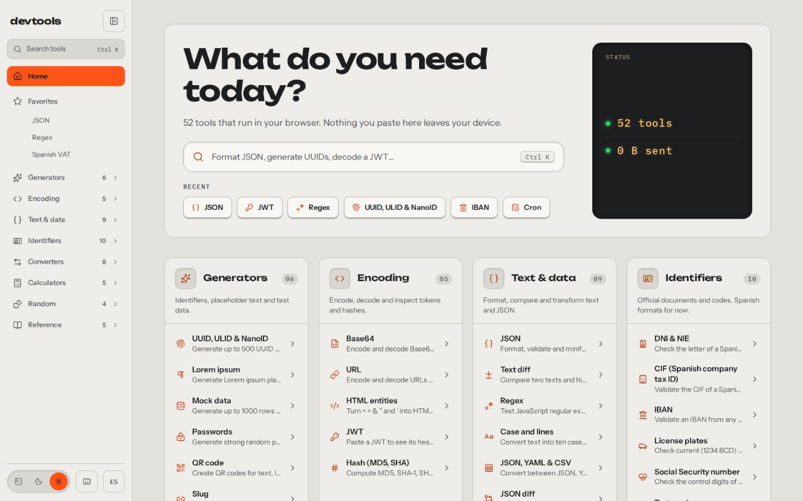
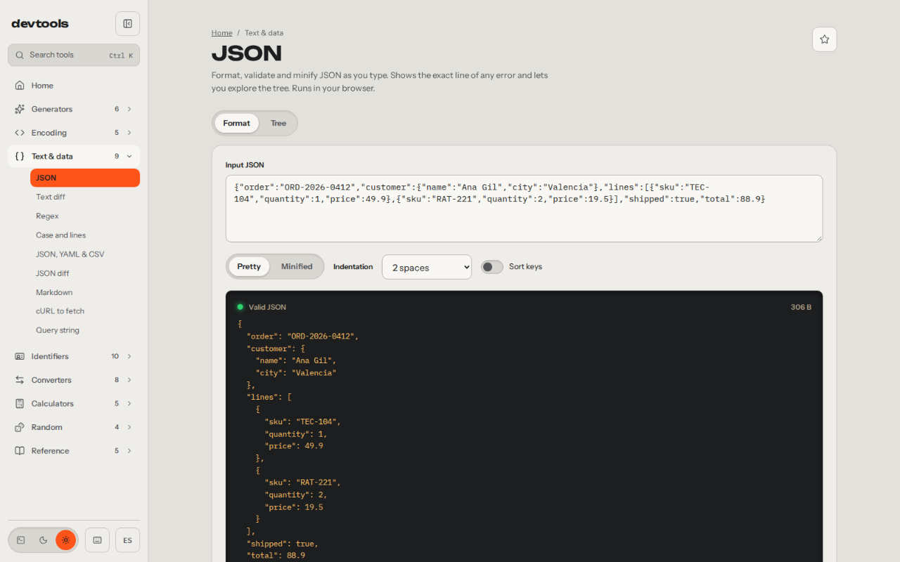
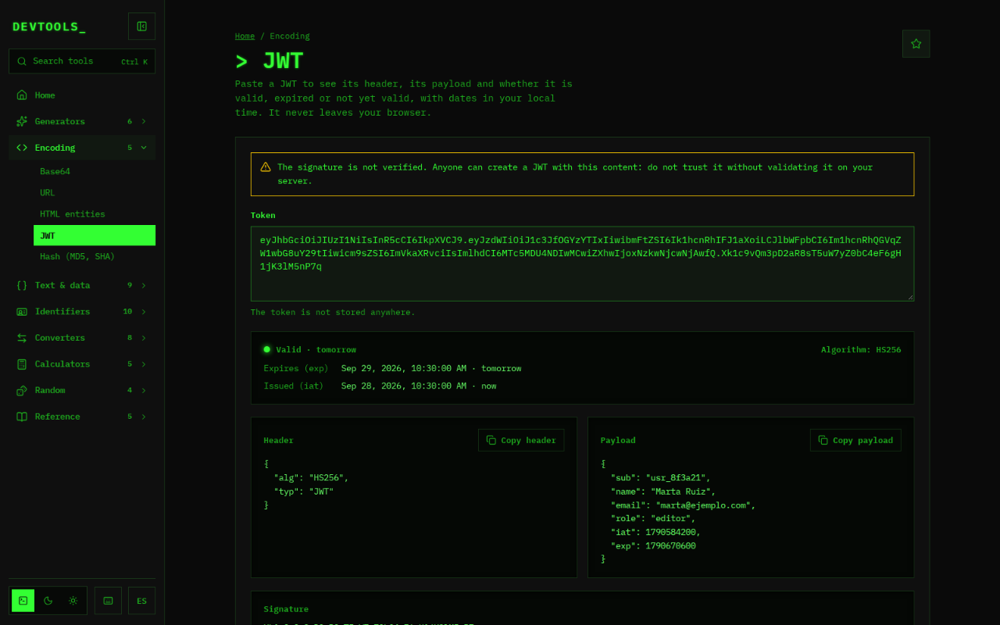
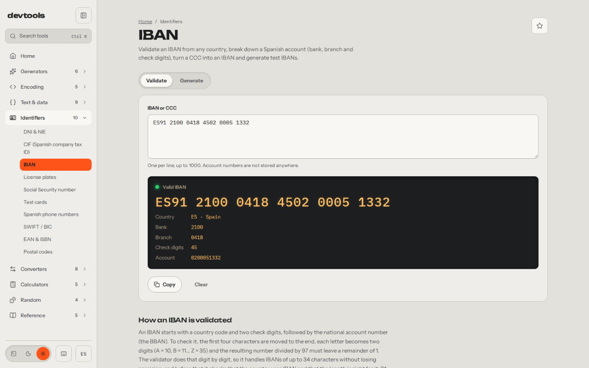
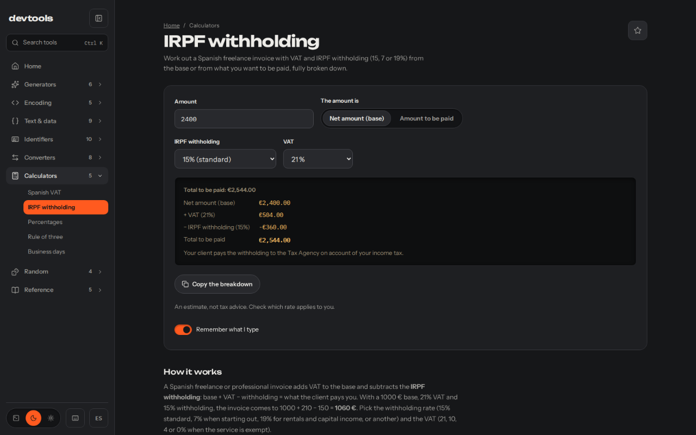
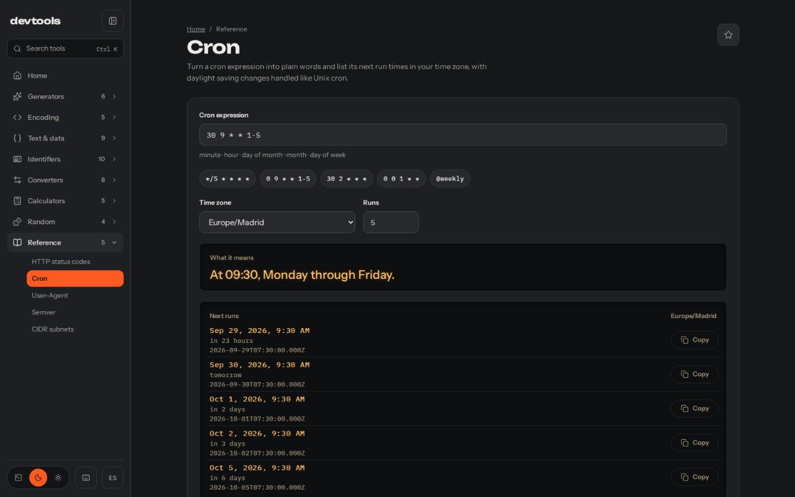

*[Español](README.md) · **English***

# devtools

**The tools you open twenty times a day, on one site.** Format a JSON, decode a
JWT, validate an IBAN, work out the VAT on an invoice or find out what a cron
does. Everything runs in your browser: what you paste never leaves your device,
and there is no account to create.

[](https://devtools.alvarotc.com/en)




## What you can do

- **Work with data without pasting it into some random site.** JSON, YAML, CSV,
  Markdown, diffs, regex, cURL and query strings are processed in the browser.
  Not a single byte goes to a server.
- **Inspect what you receive.** Decode a JWT and check when it expires, hash a
  file, break down a URL or a User-Agent, or turn a cron into words with its next
  runs.
- **Handle Spanish formats without looking them up.** DNI and NIE, CIF, IBAN,
  plates, Social Security numbers, phones and postcodes; VAT, IRPF withholding
  and business days with national holidays.
- **Generate believable test data.** UUIDs, passwords, QR codes, cards that pass
  Luhn or a thousand rows of fictional people as JSON, CSV or SQL, with a seed so
  they always come out the same.

Press `Ctrl K` on any page and type what you need: “base64”, “json” or
“cron”.

## The 52 tools

Each one has its own page in English (`/en/…`) and Spanish (`/es/…`).

### Generators

- [UUID, ULID & NanoID](https://devtools.alvarotc.com/en/uuid-generator) · UUID v4 and v7, ULID and NanoID in bulk, plus a validator that tells you the version.
- [Lorem ipsum](https://devtools.alvarotc.com/en/lorem-ipsum-generator) · Placeholder text by paragraphs, sentences or words, as plain text or HTML.
- [Mock data](https://devtools.alvarotc.com/en/mock-data-generator) · Up to 1000 rows of consistent fake data as JSON, CSV or SQL.
- [Passwords](https://devtools.alvarotc.com/en/password-generator) · Random passwords with length, character sets and entropy in plain sight.
- [QR code](https://devtools.alvarotc.com/en/qr-code-generator) · QR codes for text, URLs or WiFi, downloadable as PNG or SVG.
- [Slug](https://devtools.alvarotc.com/en/slug-generator) · Turns titles into clean slugs: no accents, no symbols.

### Encoding

- [Base64](https://devtools.alvarotc.com/en/base64-encode-decode) · Encodes and decodes Base64 with auto-detection, files included.
- [URL](https://devtools.alvarotc.com/en/url-encode-decode) · Encodes URLs and breaks any address down with its decoded parameters.
- [HTML entities](https://devtools.alvarotc.com/en/html-entities-encoder) · Turns < > & and quotes into HTML entities, and back.
- [JWT](https://devtools.alvarotc.com/en/jwt-decoder) · A JWT’s header, payload and expiry, without leaving the browser.
- [Hash (MD5, SHA)](https://devtools.alvarotc.com/en/md5-sha256-hash-generator) · MD5 and the SHA family for text or files, compared against an expected hash.

### Text & data

- [JSON](https://devtools.alvarotc.com/en/json-formatter) · Formats, validates and minifies JSON, with the exact error line and a tree view.
- [Text diff](https://devtools.alvarotc.com/en/text-diff-checker) · Compares two texts and marks added or removed lines and words.
- [Regex](https://devtools.alvarotc.com/en/regex-tester) · Tests regular expressions with highlighting, named groups and explained errors.
- [Case and lines](https://devtools.alvarotc.com/en/text-case-converter) · Converts text into ten case styles and sorts or cleans lines.
- [JSON, YAML & CSV](https://devtools.alvarotc.com/en/json-yaml-csv-converter) · Converts between JSON, YAML and CSV, detecting format and separator.
- [JSON diff](https://devtools.alvarotc.com/en/json-diff) · Compares two JSONs by structure, regardless of key order.
- [Markdown](https://devtools.alvarotc.com/en/markdown-preview) · Markdown preview with tables and task lists, plus sanitized HTML.
- [cURL to fetch](https://devtools.alvarotc.com/en/curl-to-fetch-converter) · Paste a cURL command and get the equivalent fetch call, body and headers included.
- [Query string](https://devtools.alvarotc.com/en/query-string-to-json) · Turns query strings into JSON and back, with brackets and repeated keys.

### Identifiers

- [DNI & NIE](https://devtools.alvarotc.com/en/spanish-dni-nie-validator) · Checks Spanish DNI and NIE, works out the letter and generates fake ones.
- [CIF (Spanish company tax ID)](https://devtools.alvarotc.com/en/spanish-cif-validator) · Validates a Spanish company CIF and tells you the entity type.
- [IBAN](https://devtools.alvarotc.com/en/iban-validator) · Validates IBANs from any country and breaks down Spanish accounts.
- [License plates](https://devtools.alvarotc.com/en/spanish-license-plate-validator) · Checks current and provincial Spanish plates and generates test ones.
- [Social Security number](https://devtools.alvarotc.com/en/spanish-social-security-number-validator) · Checks the Spanish Social Security number and tells you the province.
- [Test cards](https://devtools.alvarotc.com/en/test-credit-card-numbers) · Generates and validates test card numbers that pass Luhn.
- [Spanish phone numbers](https://devtools.alvarotc.com/en/spanish-phone-number-validator) · Classifies Spanish phone numbers and converts them to E.164.
- [SWIFT / BIC](https://devtools.alvarotc.com/en/swift-bic-validator) · Validates 8 or 11 character SWIFT/BIC codes and breaks them down.
- [EAN & ISBN](https://devtools.alvarotc.com/en/ean-isbn-validator) · Checks EAN-13 and ISBN codes and works out the missing digit.
- [Postal codes](https://devtools.alvarotc.com/en/spanish-postal-code-province) · From Spanish postcode to province and region, restoring the leading zero.

### Converters

- [Unix timestamp](https://devtools.alvarotc.com/en/unix-timestamp-converter) · Unix timestamps in seconds or milliseconds to dates, in any time zone.
- [Colors](https://devtools.alvarotc.com/en/color-converter) · Converts colors between HEX, RGB, HSL and OKLCH and checks contrast.
- [Number bases](https://devtools.alvarotc.com/en/number-base-converter) · Converts numbers between bases 2 to 36, with no size limit.
- [Units](https://devtools.alvarotc.com/en/unit-converter) · Length, mass, temperature, volume, area, speed and data, all at once.
- [Currency](https://devtools.alvarotc.com/en/currency-converter) · Converts currencies with ECB reference rates, offline too.
- [px to rem](https://devtools.alvarotc.com/en/px-to-rem-converter) · Pixels to rem and em with your base size, and the CSS ready to copy.
- [chmod](https://devtools.alvarotc.com/en/chmod-calculator) · Unix permissions from octal to symbolic and back, with the command ready.
- [File sizes](https://devtools.alvarotc.com/en/file-size-converter) · File sizes in SI and binary units, in bytes and bits.

### Calculators

- [Spanish VAT](https://devtools.alvarotc.com/en/spanish-vat-calculator) · Adds or removes Spanish VAT at 21, 10 or 4%, rounded to the cent.
- [IRPF withholding](https://devtools.alvarotc.com/en/spanish-irpf-withholding-calculator) · Spanish freelancer invoices with VAT and IRPF withholding, from base or net.
- [Percentages](https://devtools.alvarotc.com/en/percentage-calculator) · X% of Y, what percentage it is and percentage change between two values.
- [Rule of three](https://devtools.alvarotc.com/en/rule-of-three-calculator) · Direct and inverse rules of three with the formula and the numbers.
- [Business days](https://devtools.alvarotc.com/en/spanish-business-days-calculator) · Calendar, weekdays and business days between two dates, with Spain’s holidays.

### Random

- [Spin the wheel](https://devtools.alvarotc.com/en/spin-the-wheel) · Spins a wheel with your options, with history and remove-the-winner.
- [Shuffle list](https://devtools.alvarotc.com/en/random-list-shuffler) · Shuffles a list at random, with a seed to repeat the order.
- [Teams](https://devtools.alvarotc.com/en/random-team-generator) · Splits people into balanced teams by count or by size.
- [Dice & coin](https://devtools.alvarotc.com/en/dice-roller-coin-flip) · Dice in tabletop notation and coin flips, with an optional seed.

### Reference

- [HTTP status codes](https://devtools.alvarotc.com/en/http-status-codes) · Every HTTP status code with its meaning and when to use it.
- [Cron](https://devtools.alvarotc.com/en/cron-expression-explainer) · Translates cron expressions into words and lists the next runs.
- [User-Agent](https://devtools.alvarotc.com/en/user-agent-parser) · Parses a User-Agent: browser, engine, OS, device and whether it is a bot.
- [Semver](https://devtools.alvarotc.com/en/semver-range-checker) · Checks which versions satisfy an npm semver range and explains it.
- [CIDR subnets](https://devtools.alvarotc.com/en/cidr-subnet-calculator) · Works out network, mask, broadcast and host range of an IPv4 subnet.

## What they all share

- **Everything happens in your browser.** There is no backend: the site is
  static files. The only things that go out are a self-hosted, cookieless visit
  counter and the download of the ECB exchange rates; the currency converter
  keeps the last table to work offline.
- **They remember what you type only when it is safe.** Your JSON or regex is
  still there when you come back, if you want. Anything that can be personal
  (DNI, IBAN, NSS, phones, cards, JWT, cURL, passwords and hashes) is never
  stored.
- **Keyboard shortcuts.** `Ctrl K` or `/` to search, `?` for help, `c` to copy
  the result and `1`–`9` to switch tabs.
- **Three themes:** light (aluminium, the default), dark (graphite) and
  terminal, green phosphor on black.
- **Favorites and recent tools** in the sidebar and on the home page.
- **English and Spanish**, with their own URLs for each language.
- **On mobile too**, with a menu and panels that adapt.

## What it looks like

The JSON formatter, validating as you type:



A decoded JWT, in the terminal theme:



An IBAN broken down into bank, branch and account:



A Spanish freelancer invoice, with VAT and IRPF withholding, in the dark theme:



And a cron explained in words, with its next runs:



## Author

Made by [Alvaro Torres](https://github.com/alvarotorresc). [MIT](./LICENSE) licensed.

## Development

Astro 7 and Svelte 5, built as a static site. Needs Node 22.12+ and pnpm 10.

```bash
pnpm install
pnpm dev                     # http://localhost:4321
pnpm test                    # logic tests (Vitest)
pnpm build && pnpm test:e2e  # browser tests (Playwright)
pnpm lint && pnpm check
```

### Adding a tool

1. Create `src/tools/<id>/` with `meta.ts`, `logic.ts`, `logic.test.ts`,
   `strings.ts`, `<Name>.svelte`, `content.es.md` and `content.en.md`.
2. Add the meta to `src/tools/registry.ts`.
3. Add a line to `src/components/ToolIsland.astro`.
4. Add its scene to `media/shots/scenes.mjs` and its texts to
   `media/shots/labels.mjs`: the screenshot script fails if one is missing.

`pnpm test` fails if any text, slug or content is missing in either language.

### Screenshots

`media/shots/` takes the site's screenshots with the repo's own Playwright: it
builds the site, serves it on port 4790 and captures every tool with a fictional
example filled in, in both languages.

```bash
pnpm media          # shots, texts (labels.json), promos and icon in media/out/
pnpm media:shots --only tool-12 --lang en --no-build
pnpm media:readme   # regenerates .github/readme/ at 1280 px
```

Themes and their tokens live in `src/styles/tokens.css`.
