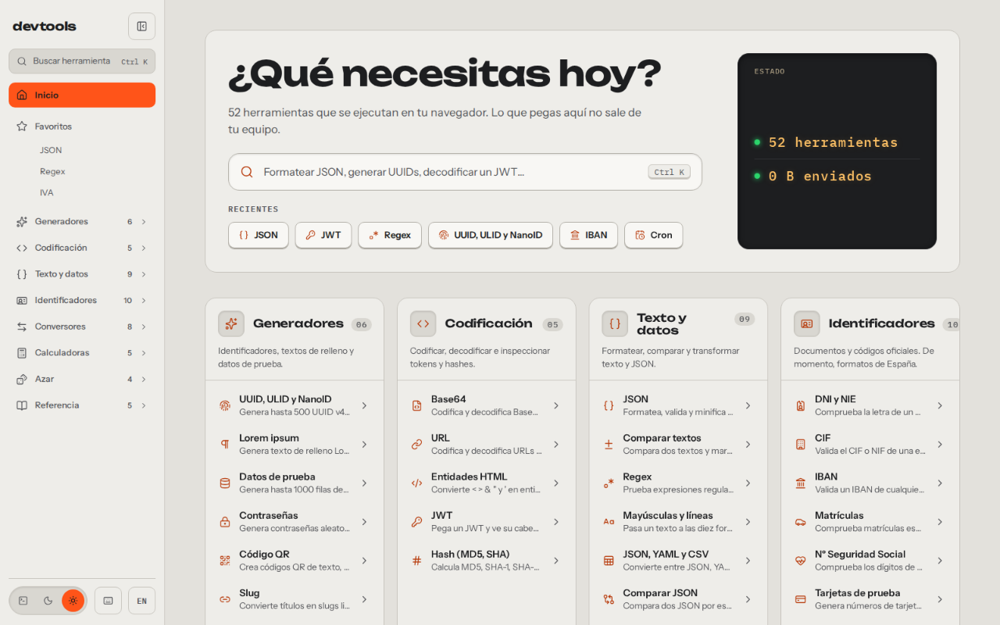
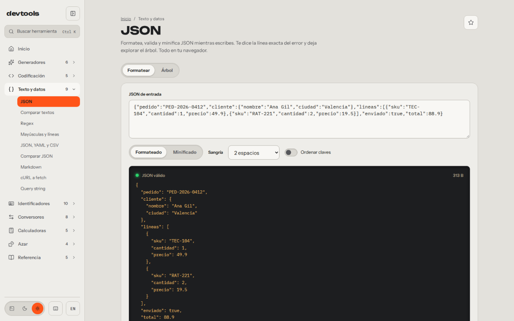
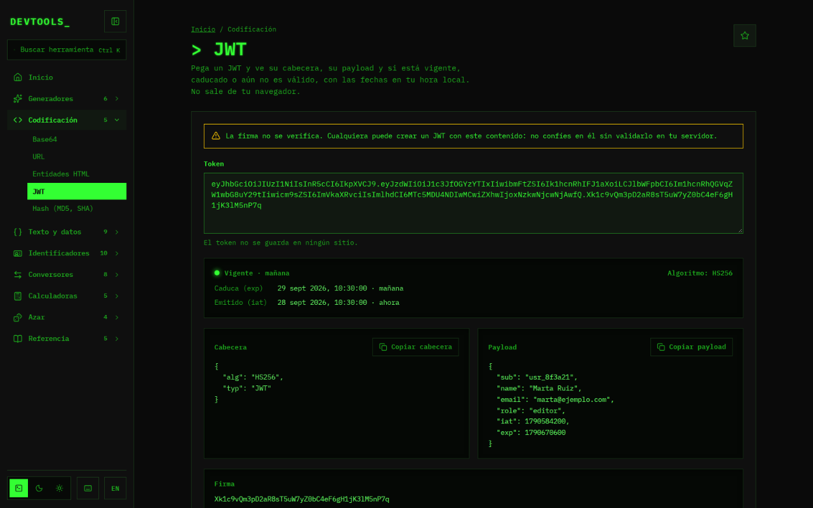
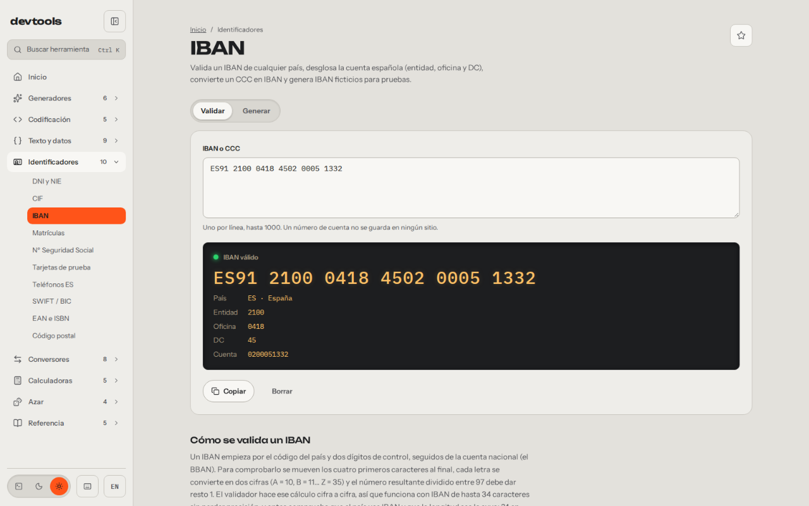
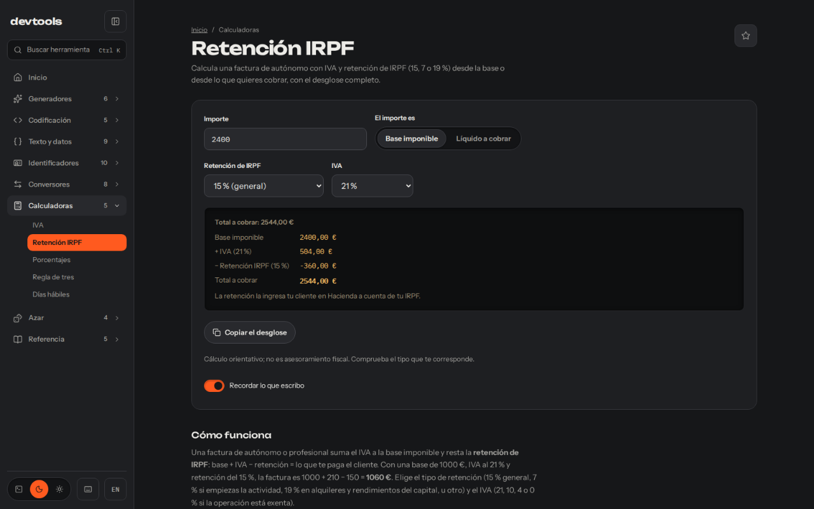
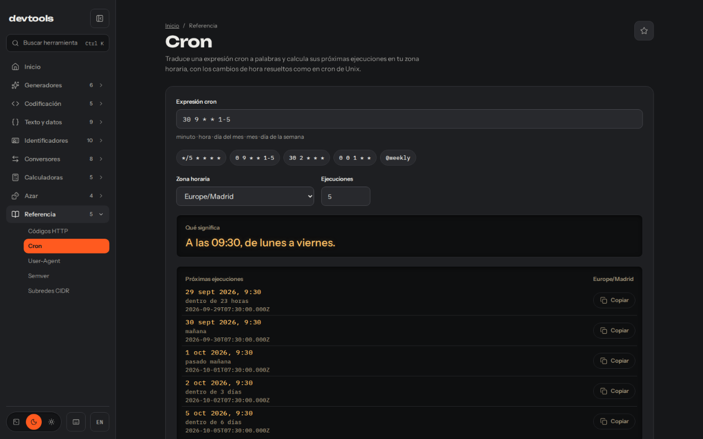

***Español** · [English](README.en.md)*

# devtools

**Las herramientas que abres veinte veces al día, en una sola web.** Formatear un
JSON, decodificar un JWT, validar un IBAN, sacar el IVA de una factura o saber
qué hace un cron. Todo se ejecuta en tu navegador: lo que pegas no sale de tu
equipo, y no hay cuenta que crear.

[](https://devtools.alvarotc.com/es)




## Qué puedes hacer

- **Trabajar con datos sin pegarlos en una web cualquiera.** JSON, YAML, CSV,
  Markdown, diffs, regex, cURL y query strings se procesan en el navegador. Ni
  un byte sale hacia un servidor.
- **Inspeccionar lo que te llega.** Decodifica un JWT y mira si caduca, saca los
  hashes de un archivo, desglosa una URL o un User-Agent, o traduce un cron a
  palabras con sus próximas ejecuciones.
- **Resolver lo español sin buscarlo.** DNI y NIE, CIF, IBAN, matrículas, número
  de la Seguridad Social, teléfonos y códigos postales; IVA, retención de IRPF y
  días hábiles con los festivos nacionales.
- **Generar datos de prueba creíbles.** UUID, contraseñas, QR, tarjetas que pasan
  Luhn o mil filas de personas ficticias en JSON, CSV o SQL, con semilla para que
  salgan siempre iguales.

Pulsa `Ctrl K` en cualquier página y escribe lo que buscas: «base64», «iva» o
«cron».

## Las 52 herramientas

Cada una tiene su página en español (`/es/…`) y en inglés (`/en/…`).

### Generadores

- [UUID, ULID y NanoID](https://devtools.alvarotc.com/es/generador-uuid) · UUID v4 y v7, ULID y NanoID en lote, y un validador que dice qué versión es.
- [Lorem ipsum](https://devtools.alvarotc.com/es/generador-lorem-ipsum) · Texto de relleno por párrafos, frases o palabras, en texto plano o en HTML.
- [Datos de prueba](https://devtools.alvarotc.com/es/generador-datos-de-prueba) · Hasta 1000 filas de datos ficticios coherentes en JSON, CSV o SQL.
- [Contraseñas](https://devtools.alvarotc.com/es/generador-contrasenas) · Contraseñas aleatorias con longitud, juegos de caracteres y entropía a la vista.
- [Código QR](https://devtools.alvarotc.com/es/generador-codigo-qr) · Códigos QR de texto, URL o WiFi, descargables en PNG o SVG.
- [Slug](https://devtools.alvarotc.com/es/generador-slug) · Convierte títulos en slugs limpios: sin tildes, eñes ni símbolos.

### Codificación

- [Base64](https://devtools.alvarotc.com/es/codificar-decodificar-base64) · Codifica y decodifica Base64 con detección automática, también archivos.
- [URL](https://devtools.alvarotc.com/es/codificar-decodificar-url) · Codifica URLs y desglosa cualquier dirección con sus parámetros decodificados.
- [Entidades HTML](https://devtools.alvarotc.com/es/codificar-entidades-html) · Convierte < > & y comillas en entidades HTML, y al revés.
- [JWT](https://devtools.alvarotc.com/es/decodificador-jwt) · Cabecera, payload y caducidad de un JWT, sin que salga del navegador.
- [Hash (MD5, SHA)](https://devtools.alvarotc.com/es/generador-hash-md5-sha256) · MD5 y la familia SHA de un texto o archivo, con comparación contra un hash esperado.

### Texto y datos

- [JSON](https://devtools.alvarotc.com/es/formateador-json) · Formatea, valida y minifica JSON, con la línea exacta de cada error y vista de árbol.
- [Comparar textos](https://devtools.alvarotc.com/es/comparar-textos) · Compara dos textos y marca líneas y palabras añadidas o quitadas.
- [Regex](https://devtools.alvarotc.com/es/probador-regex) · Prueba expresiones regulares con resaltado, grupos con nombre y errores explicados.
- [Mayúsculas y líneas](https://devtools.alvarotc.com/es/convertir-mayusculas-minusculas) · Pasa un texto a diez formatos de mayúsculas y ordena o limpia líneas.
- [JSON, YAML y CSV](https://devtools.alvarotc.com/es/conversor-json-yaml-csv) · Convierte entre JSON, YAML y CSV detectando el formato y el separador.
- [Comparar JSON](https://devtools.alvarotc.com/es/comparar-json) · Compara dos JSON por estructura, sin importar el orden de las claves.
- [Markdown](https://devtools.alvarotc.com/es/vista-previa-markdown) · Vista previa de Markdown con tablas y listas de tareas, y el HTML ya saneado.
- [cURL a fetch](https://devtools.alvarotc.com/es/convertir-curl-a-fetch) · Pega un comando cURL y obtén el fetch equivalente, con cuerpo y cabeceras.
- [Query string](https://devtools.alvarotc.com/es/conversor-query-string-json) · Convierte query strings en JSON y al revés, con corchetes y claves repetidas.

### Identificadores

- [DNI y NIE](https://devtools.alvarotc.com/es/validador-dni-nie) · Comprueba DNI y NIE, calcula la letra y genera documentos ficticios.
- [CIF](https://devtools.alvarotc.com/es/validador-cif) · Valida el CIF de una empresa y dice el tipo de entidad.
- [IBAN](https://devtools.alvarotc.com/es/validador-iban) · Valida IBAN de cualquier país y desglosa la cuenta española.
- [Matrículas](https://devtools.alvarotc.com/es/validador-matriculas) · Comprueba matrículas actuales y provinciales, y genera matrículas de prueba.
- [Nº Seguridad Social](https://devtools.alvarotc.com/es/validador-numero-seguridad-social) · Comprueba los dígitos de control del NSS y dice la provincia.
- [Tarjetas de prueba](https://devtools.alvarotc.com/es/tarjetas-de-credito-de-prueba) · Genera y valida números de tarjeta de prueba que pasan Luhn.
- [Teléfonos ES](https://devtools.alvarotc.com/es/validador-telefonos-espana) · Clasifica teléfonos españoles y los pasa a E.164.
- [SWIFT / BIC](https://devtools.alvarotc.com/es/validador-swift-bic) · Valida códigos SWIFT/BIC de 8 u 11 caracteres y los desglosa.
- [EAN e ISBN](https://devtools.alvarotc.com/es/validador-ean-isbn) · Comprueba códigos EAN-13 e ISBN y calcula el dígito que falta.
- [Código postal](https://devtools.alvarotc.com/es/codigo-postal-provincia) · De código postal a provincia y comunidad, recuperando el 0 inicial.

### Conversores

- [Timestamp Unix](https://devtools.alvarotc.com/es/conversor-timestamp-unix) · Timestamps Unix en segundos o milisegundos a fecha, en cualquier zona horaria.
- [Colores](https://devtools.alvarotc.com/es/conversor-colores) · Convierte colores entre HEX, RGB, HSL y OKLCH y comprueba el contraste.
- [Bases numéricas](https://devtools.alvarotc.com/es/conversor-bases-numericas) · Convierte números entre bases de 2 a 36, sin límite de tamaño.
- [Unidades](https://devtools.alvarotc.com/es/conversor-unidades) · Longitud, masa, temperatura, volumen, área, velocidad y datos, todo a la vez.
- [Divisas](https://devtools.alvarotc.com/es/conversor-divisas) · Convierte divisas con los tipos de referencia del BCE, también sin conexión.
- [px a rem](https://devtools.alvarotc.com/es/conversor-px-rem) · Píxeles a rem y em con tu tamaño base, y el CSS listo para copiar.
- [chmod](https://devtools.alvarotc.com/es/calculadora-chmod) · Permisos Unix de octal a simbólico y al revés, con la orden lista.
- [Tamaños de archivo](https://devtools.alvarotc.com/es/conversor-tamano-archivos) · Tamaños de archivo en unidades SI y binarias, en bytes y en bits.

### Calculadoras

- [IVA](https://devtools.alvarotc.com/es/calculadora-iva) · Suma o quita el IVA al 21, 10 o 4 %, redondeado al céntimo.
- [Retención IRPF](https://devtools.alvarotc.com/es/calculadora-retencion-irpf) · Factura de autónomo con IVA y retención de IRPF, desde la base o el líquido.
- [Porcentajes](https://devtools.alvarotc.com/es/calculadora-porcentajes) · X % de Y, qué porcentaje es y variación porcentual entre dos valores.
- [Regla de tres](https://devtools.alvarotc.com/es/regla-de-tres) · Reglas de tres directas e inversas con la fórmula y los números.
- [Días hábiles](https://devtools.alvarotc.com/es/calculadora-dias-habiles) · Días naturales, laborables y hábiles entre dos fechas, con festivos de España.

### Azar

- [Ruleta](https://devtools.alvarotc.com/es/ruleta-aleatoria) · Gira una ruleta con tus opciones, con historial y opción de quitar la ganadora.
- [Mezclar lista](https://devtools.alvarotc.com/es/mezclar-lista-aleatoria) · Mezcla una lista al azar, con semilla para repetir el orden.
- [Equipos](https://devtools.alvarotc.com/es/generador-equipos-aleatorios) · Reparte personas en equipos equilibrados por número o por tamaño.
- [Dados y moneda](https://devtools.alvarotc.com/es/lanzar-dados-moneda) · Dados con notación de rol y lanzamiento de moneda, con semilla opcional.

### Referencia

- [Códigos HTTP](https://devtools.alvarotc.com/es/codigos-estado-http) · Todos los códigos de estado HTTP con su significado y cuándo usarlos.
- [Cron](https://devtools.alvarotc.com/es/explicar-expresion-cron) · Traduce expresiones cron a palabras y calcula las próximas ejecuciones.
- [User-Agent](https://devtools.alvarotc.com/es/analizar-user-agent) · Analiza un User-Agent: navegador, motor, sistema, dispositivo y si es un bot.
- [Semver](https://devtools.alvarotc.com/es/comprobar-rango-semver) · Comprueba qué versiones cumplen un rango semver de npm y lo explica.
- [Subredes CIDR](https://devtools.alvarotc.com/es/calculadora-subredes-cidr) · Calcula red, máscara, broadcast y rango de hosts de una subred IPv4.

## Lo que comparten todas

- **Todo pasa en tu navegador.** No hay backend: la web son ficheros estáticos.
  Fuera de ella solo salen un contador de visitas y la descarga de los tipos de
  cambio del BCE; el conversor de divisas guarda la última tabla para funcionar
  sin conexión.
- **Recuerdan lo que escribes solo cuando es seguro.** El JSON o la regex siguen
  ahí al volver, y puedes desactivarlo en cada herramienta. Lo que puede ser
  personal (DNI, IBAN, NSS, teléfonos, tarjetas, JWT, cURL, contraseñas y
  hashes) nunca se guarda.
- **Atajos de teclado.** `Ctrl K` o `/` para buscar, `?` para la ayuda, `c` para
  copiar el resultado y `1`–`9` para cambiar de pestaña.
- **Tres temas:** claro (aluminio, el de por defecto), oscuro (grafito) y
  terminal, fósforo verde sobre negro.
- **Favoritos y recientes** en la barra lateral y en la portada.
- **Español e inglés**, con URLs propias para cada idioma.
- **En el móvil también**, con menú y paneles que se adaptan.

## Cómo se ve

El formateador de JSON, validando mientras escribes:



Un JWT decodificado, en el tema terminal:



Un IBAN desglosado en entidad, oficina y cuenta:



La factura de un autónomo, con IVA y retención de IRPF, en el tema oscuro:



Y un cron explicado en palabras, con sus próximas ejecuciones:



## Autor

Hecha por [Alvaro Torres](https://github.com/alvarotorresc). Licencia [MIT](./LICENSE).

## Desarrollo

Astro 7 y Svelte 5, generado como sitio estático. Requiere Node 22.12+ y pnpm 10.

```bash
pnpm install
pnpm dev                     # http://localhost:4321
pnpm test                    # tests de lógica (Vitest)
pnpm build && pnpm test:e2e  # tests de navegador (Playwright)
pnpm lint && pnpm check
```

### Añadir una herramienta

1. Crea `src/tools/<id>/` con `meta.ts`, `logic.ts`, `logic.test.ts`,
   `strings.ts`, `<Nombre>.svelte`, `content.es.md` y `content.en.md`.
2. Añade la meta a `src/tools/registry.ts`.
3. Añade una línea a `src/components/ToolIsland.astro`.
4. Añade su escena a `media/shots/scenes.mjs` y sus textos a
   `media/shots/labels.mjs`: el script de capturas falla si falta alguna.

`pnpm test` falla si falta algún texto, slug o contenido en alguno de los dos idiomas.

### Capturas

`media/shots/` saca las capturas de la web con el Playwright del propio repo:
construye el sitio, lo sirve en el puerto 4790 y fotografía cada herramienta con
un ejemplo ficticio relleno, en los dos idiomas.

```bash
pnpm media          # capturas, textos (labels.json), promos e icono en media/out/
pnpm media:shots --only tool-12 --lang es --no-build
pnpm media:readme   # regenera .github/readme/ a 1280 px
```

Los temas y sus tokens están en `src/styles/tokens.css`.
